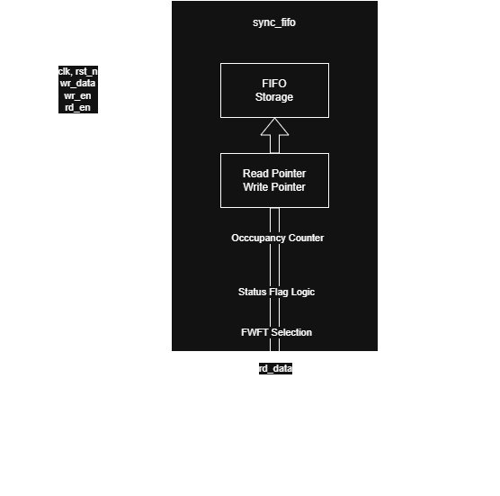

# FIFO SV Core Architecture

## 1. Design Overview

The Parameterized Synchronous FIFO SV Core follows a modular architecture centered around a reusable synchronous FIFO module operating entirely within a single clock domain.

The design provides temporary storage between producer and consumer logic while preserving FIFO ordering. Configuration parameters allow the same RTL implementation to support different data widths, FIFO depths, operating modes, and programmable threshold values.

Version 1.0 supports both Standard FIFO operation and optional First-Word Fall-Through (FWFT) operation while remaining fully synthesizable for FPGA and ASIC implementations.

---

## 2. Design Philosophy

The FIFO SV Core is designed according to the following principles:

* Modular design
* Parameterization
* Single clock domain
* Reusability
* Synthesizable RTL
* Clear separation between datapath and control
* Documentation-driven development

The implementation avoids vendor-specific primitives wherever possible, allowing the same RTL to target FPGA and ASIC technologies through standard synthesis flows.

---

## 3. Module Hierarchy

Version 1.0 consists of a single reusable FIFO module.


Internally, the module is logically divided into:

| Logical Block      | Description                        |
| ------------------ | ---------------------------------- |
| FIFO Storage       | Stores FIFO entries                |
| Write Datapath     | Accepts write transactions         |
| Read Datapath      | Provides read transactions         |
| Pointer Management | Maintains read/write pointers      |
| Occupancy Counter  | Tracks FIFO level                  |
| Status Flag Logic  | Generates status outputs           |
| FWFT Logic         | Optional combinational output path |


Although implemented as a single synthesizable module, this logical partitioning improves readability and maintainability.

---

## 4. Data Flow

### Write Path

```text
wr_data
   │
   ▼
FIFO Storage
```

Incoming write data is accepted whenever a valid write request is received and sufficient storage is available.

### Read Path

```text
FIFO Storage
   │
   ▼
rd_data
```

The oldest valid entry is presented to the output while preserving FIFO ordering.

---

## 5. Module Architecture



### 5.1 FIFO Storage

The FIFO storage is implemented as a parameterized register array.

```text
logic [DATA_WIDTH-1:0] mem [0:DEPTH-1]
```

Each array element stores one FIFO entry. The storage depth is configurable through the `DEPTH` parameter, allowing the same RTL implementation to support arbitrary positive FIFO depths, including non-power-of-two values.

Write operations update the memory only when a valid write transaction is accepted. Read operations access the memory through the current read pointer. Memory contents are not cleared during read operations or reset, as unread entries become invalid once the read pointer advances.

The implementation relies on synthesis tools to infer an appropriate storage structure for the target technology, such as registers, distributed memory, or block RAM on FPGAs.

### 5.2 Write Datapath

The write datapath accepts input data whenever `wr_en` is asserted and the FIFO is not full.

A successful write operation stores `wr_data` at the location addressed by the current write pointer. After the write completes, the write pointer advances to the next storage location using explicit wrap-around logic.

Write requests received while the FIFO is full are ignored, and an overflow pulse is generated for one clock cycle.

### 5.3 Read Datapath

The read datapath retrieves the oldest valid entry from the FIFO whenever `rd_en` is asserted and the FIFO is not empty.

In Standard FIFO mode, the output data is registered before appearing on the output interface.

In First-Word Fall-Through (FWFT) mode, the output data is driven directly from the memory location addressed by the current read pointer. This allows the first available data word to appear immediately without requiring an initial read operation.

Read requests received while the FIFO is empty are ignored, and an underflow pulse is generated for one clock cycle.

### 5.4 Pointer Management

The FIFO uses independent read and write pointers to track the next memory locations for read and write operations.

Both pointers advance only after their respective operations are successfully accepted. Pointer advancement uses explicit wrap-around logic, allowing the implementation to support arbitrary FIFO depths without requiring the depth to be a power of two.

Pointer values are reset to zero during reset.

### 5.5 Occupancy Counter

FIFO occupancy is tracked using a dedicated level counter.

The occupancy counter increments after successful write operations, decrements after successful read operations, and remains unchanged when simultaneous read and write operations are both accepted.

The current occupancy is exported through the `level` output and forms the basis for generating the FIFO status flags.

### 5.6 Status Flag Generation

FIFO status signals are derived from the current occupancy level.

The implementation generates the following status indicators:

- Full
- Empty
- Almost Full
- Almost Empty
- Overflow
- Underflow

The Full and Empty flags indicate whether additional write or read operations can be accepted.

Almost Full and Almost Empty are generated using programmable threshold parameters.

Overflow and Underflow are single-cycle pulse signals indicating that an invalid write or read request was attempted.

### 5.7 First-Word Fall-Through (FWFT) Architecture

The FIFO supports two operating modes selected through the compile-time `FWFT` parameter.

In Standard FIFO mode, output data is registered and becomes valid after a successful read operation.

In FWFT mode, the output is continuously driven from the memory location addressed by the current read pointer whenever the FIFO is not empty. This allows the first stored word to become immediately available at the output without requiring an initial read cycle.

The operating mode is selected during elaboration, allowing synthesis tools to optimize away the unused logic.

---

## 6. Top-Level Integration

The FIFO SV Core is implemented as a standalone reusable IP operating entirely within a single clock domain. The module integrates the storage memory, read and write datapaths, pointer management, occupancy counter, status flag generation, and optional First-Word Fall-Through (FWFT) logic behind a configurable SystemVerilog interface.

---

## 7. Future Architecture Extensions

Future versions of the FIFO SV Core may include:

* Asynchronous FIFO
* Error correction (ECC)
* Parity generation
* Runtime-programmable thresholds
* AXI-Stream wrapper
* APB wrapper
* AXI-Lite wrapper
* Vendor-specific memory inference
* Dual-port memory implementation
* Formal verification
