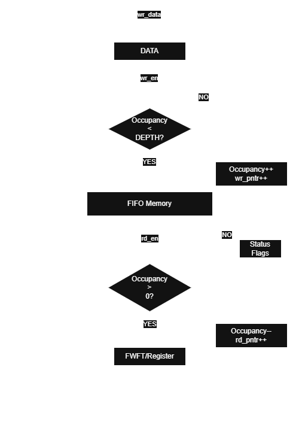
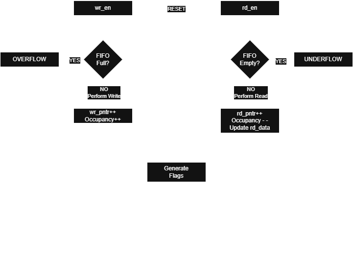

# FIFO SV Core Implementation

## 1. Overview

This document describes the implementation details of the Parameterized Synchronous FIFO SV Core.

It complements the project specification and architecture documents by documenting the RTL organization, coding style, implementation decisions, design trade-offs, synthesis results, and timing analysis throughout the development of the project.

---

## 2. Coding Guidelines

The FIFO SV Core follows the implementation guidelines below:

* SystemVerilog is used throughout the project.
* Only synthesizable RTL constructs are used.
* Sequential logic is implemented using `always_ff`.
* Combinational logic is implemented using `always_comb`.
* Non-blocking assignments (`<=`) are used for sequential logic.
* Blocking assignments (`=`) are used for combinational logic.
* Parameters are validated during elaboration whenever possible.
* The design operates entirely within a single clock domain.
* Clock-enable signals are preferred over internally generated clocks where applicable.
* The design is fully parameterized wherever practical.

---

## 3. Synchronous FIFO

### 3.1 Module Overview

The FIFO SV Core is implemented as a single synthesizable SystemVerilog module that provides a configurable synchronous FIFO supporting both Standard FIFO and First-Word Fall-Through (FWFT) operating modes.

The implementation is fully parameterized, allowing the same RTL to support different data widths, FIFO depths, and programmable threshold values without requiring source code modifications.

Internally, the design consists of:

- Parameterized storage memory
- Independent read and write pointers
- Occupancy counter
- Status flag generation
- Optional FWFT datapath
- Immediate parameter validation

The design operates entirely within a single clock domain and uses synchronous control logic throughout.

### 3.2 Interface

#### Parameters

| Parameter | Description |
|-----------|-------------|
| `DATA_WIDTH` | Width of each FIFO data word |
| `DEPTH` | Number of FIFO entries |
| `FWFT` | Enables First-Word Fall-Through mode |
| `AFULL_THRESHOLD` | Almost-full threshold |
| `AEMPTY_THRESHOLD` | Almost-empty threshold |

#### Inputs

| Signal | Description |
|--------|-------------|
| `clk` | System clock |
| `rst_n` | Active-low synchronous reset |
| `wr_en` | Write enable |
| `rd_en` | Read enable |
| `wr_data` | Input write data |

#### Outputs

| Signal | Description |
|--------|-------------|
| `rd_data` | Output read data |
| `full` | FIFO full indicator |
| `empty` | FIFO empty indicator |
| `almost_full` | Almost-full indicator |
| `almost_empty` | Almost-empty indicator |
| `overflow` | Overflow pulse |
| `underflow` | Underflow pulse |
| `level` | Current FIFO occupancy |

### 3.3 Derived Parameters

| Parameter | Description |
|-----------|-------------|
| `ADDR_WIDTH` | Width of the read and write pointers |
| `LEVEL_WIDTH` | Width of the occupancy counter |

### 3.4 Internal Registers

| Register | Width | Purpose |
|----------|------:|---------|
| `mem` | `DATA_WIDTH × DEPTH` | FIFO storage array |
| `write_ptr` | `ADDR_WIDTH` | Next write location |
| `read_ptr` | `ADDR_WIDTH` | Next read location |
| `level_reg` | `LEVEL_WIDTH` | Current FIFO occupancy |
| `rd_data_reg` | `DATA_WIDTH` | Registered output data for Standard FIFO mode |

### 3.5 Combinational Signals

The implementation uses combinational logic to determine whether read and write operations are accepted during the current clock cycle.

The primary control signals are:

| Signal | Purpose |
|---------|---------|
| `do_write` | Indicates that the current write request is accepted |
| `do_read` | Indicates that the current read request is accepted |

These signals simplify the sequential logic by separating request qualification from state updates.

### 3.6 Datapath & Flow

The FIFO datapath consists of:

- Storage memory
- Write datapath
- Read datapath
- Occupancy counter
- Status flag logic

Accepted write operations store input data into the FIFO memory and advance the write pointer. Accepted read operations retrieve the oldest stored data and advance the read pointer. Simultaneous accepted read and write operations update both pointers while leaving FIFO occupancy unchanged.

### 3.7 Algorithm

1. Validate configuration parameters.
2. Evaluate accepted read and write requests.
3. Update FIFO memory.
4. Advance the read and write pointers.
5. Update the occupancy counter.
6. Update the registered output data (Standard FIFO only).
7. Generate status outputs.

### 3.8 Design Decisions

- Register-array based FIFO storage.
- Single clock domain.
- Explicit pointer wrap-around.
- Dedicated occupancy counter.
- Compile-time Standard/FWFT selection.
- Compile-time parameter validation.
- Synthesizable RTL suitable for FPGA and ASIC flows.

### 3.9 Corner Cases

| Condition | Behaviour |
|-----------|-----------|
| Write when Full | Write ignored, overflow asserted |
| Read when Empty | Read ignored, underflow asserted |
| Simultaneous Read/Write (Partial) | Both operations accepted, occupancy unchanged |
| Simultaneous Read/Write (Full) | Read accepted, write rejected |
| Simultaneous Read/Write (Empty) | Write accepted, write performed |
| Reset | Pointers, occupancy counter, and registered outputs cleared |

### 3.10 Resource Utilization

#### Synthesis Results

- Tool: Yosys
- Scripts:
  - `scripts/synth_standard_fifo.ys`
  - `scripts/synth_fwft_fifo.ys`

#### Generic Synthesis Summary

| Metric | Standard FIFO | FWFT FIFO |
|---------|--------------:|----------:|
| Tool | Yosys 0.52 | Yosys 0.52 |
| Top Module | `sync_fifo` | `sync_fifo` |
| Number of Ports | 13 | 13 |
| Number of Port Bits | 31 | 31 |
| Number of Wires | 164 | 158 |
| Number of Wire Bits | 811 | 770 |
| Public Wires | 35 | 34 |
| Public Wire Bits | 182 | 174 |
| Memories | 0 | 0 |
| Memory Bits | 0 | 0 |
| Processes | 0 | 0 |
| Total Cells | 514 | 488 |

#### Cell Breakdown

| Cell Type       | Standard FIFO | FWFT FIFO |
| :-------------- | ------------: | --------: |
| `$_AND_`        |        **64** |    **63** |
| `$_DFFE_PP_`    |       **136** |   **128** |
| `$_MUX_`        |       **238** |   **221** |
| `$_NOT_`        |        **20** |    **20** |
| `$_OR_`         |        **25** |    **25** |
| `$_SDFFE_PN0P_` |        **13** |    **13** |
| `$_SDFF_PN0_`   |         **4** |     **4** |
| `$_XOR_`        |        **14** |    **14** |
| **Total Cells** |       **514** |   **488** |

#### Waveform

#### Verification Status

- [x] RTL Simulation
- [x] Self-checking Testbench
- [x] Assertions
- [x] Generic Synthesis
- [x] Sky130 Technology Mapping
- [x] Static Timing Analysis

---

## 4. Technology Mapped Synthesis

- Tool: Yosys
- Technology: Sky130 HDLL
- Scripts:
  - `scripts/synth_standard_fifo_sky130.ys`
  - `scripts/synth_fwft_fifo_sky130.ys`

| Metric | Standard FIFO | FWFT FIFO |
|---------|--------------:|----------:|
| Total Cells | 561 | 512 |
| Total Area (µm²) | 7269.4720 | 7070.5312 |
| Area Difference | — | −198.9408 |
| Area Reduction | — | 2.74% |

---

## 5. Static Timing Analysis

- Tool: OpenSTA
- Library: Sky130 HDLL TT
- Scripts:
  - `scripts/timing_standard_fifo.tcl`
  - `scripts/timing_fwft_fifo.tcl`
- Voltage: 1.8 V
- Temperature: 25°C
- Clock period: 20 ns (50 MHz)

### Timing Summary

| Metric | Standard FIFO | FWFT FIFO |
|---------|--------------:|----------:|
| Worst Setup Slack | 9.48 ns | 14.27 ns |
| WNS | 0.00 ns | 0.00 ns |
| TNS | 0.00 ns | 0.00 ns |
| Setup Timing | PASS | PASS |

No setup timing violations were observed under the applied timing constraints.

The reported `set_input_delay` warning is caused by constraining the clock port as a primary input and does not indicate a design timing violation.

---

## 6. Summary

| Feature                |   Standard FIFO   |     FWFT FIFO     |
| :--------------------- | :---------------: | :---------------: |
| Registered Read Output |         YES         |         NO         |
| First Read Latency     |      1 Clock      |      0 Clock      |
| Generic RTL Cells      |      **514**      |      **488**      |
| Sky130 Cells           |      **561**      |      **512**      |
| Total Area             | **7269.4720 µm²** | **7070.5312 µm²** |
| Worst Setup Slack      |    **9.48 ns**    |    **14.27 ns**   |
| Timing Closure         |        PASS       |        PASS       |

## 7. Future Improvements

Future versions of the FIFO SV Core may include:

* Asynchronous FIFO
* Error correction (ECC)
* Parity generation
* Runtime-programmable thresholds
* AXI-Stream wrapper
* APB wrapper
* AXI-Lite wrapper
* Vendor-specific memory inference
* Dual-port memory implementation
* Formal verification
