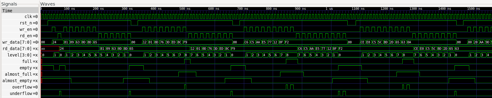
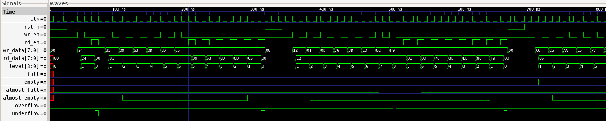
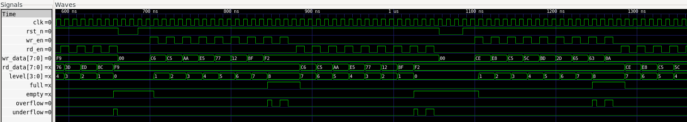

# FIFO SV Core Verification Plan

## 1. Verification Objectives

The objective of verification is to ensure that the Parameterized Synchronous FIFO SV Core satisfies all functional requirements defined in the project specification.

Verification confirms correct functionality through simulation, self-checking testbenches, assertions, synthesis, and static timing analysis.

---

## 2. Verification Methodology

Verification follows a layered approach consisting of:

- Directed testing
- Self-checking testbenches
- Immediate SystemVerilog assertions
- Waveform analysis
- Generic RTL synthesis using Yosys
- Technology-mapped synthesis using Sky130 HDLL
- Static timing analysis using OpenSTA

---

## 3. Verification Environment

| Tool | Use |
|------|-----|
| Icarus Verilog | RTL simulation |
| GTKWave | Waveform viewing |
| Yosys | Generic RTL synthesis |
| Yosys + Sky130 HDLL | Technology mapping |
| OpenSTA | Static timing analysis |

---

## 4. Module Verification

### 4.1 Synchronous FIFO

Verified using a self-checking SystemVerilog testbench.

Verified properties:

- Reset behaviour
- Single write operation
- Single read operation
- Multiple write operations
- Multiple read operations
- FIFO full detection
- FIFO empty detection
- Almost-full flag generation
- Almost-empty flag generation
- Overflow detection
- Underflow detection
- Simultaneous read and write operations
- Randomized stress testing
- Standard FIFO mode
- First-Word Fall-Through (FWFT) mode
- Parameterized FIFO depth and data width

---

## 5. Functional Test Cases

Verified properties:

- Reset behaviour
- Single write transaction
- Single read transaction
- Multiple write transactions
- Multiple read transactions
- FIFO fill operation
- FIFO empty operation
- Overflow condition
- Underflow condition
- Almost-full threshold
- Almost-empty threshold
- Simultaneous read/write operation
- Randomized stress testing
- Standard FIFO mode
- FWFT mode

### Test Summary

| Test Case | Standard FIFO | FWFT FIFO |
|-----------|:-------------:|:---------:|
| Reset | ✓ | ✓ |
| Single Write | ✓ | ✓ |
| Single Read | ✓ | ✓ |
| Multiple Writes | ✓ | ✓ |
| Multiple Reads | ✓ | ✓ |
| Fill FIFO | ✓ | ✓ |
| Empty FIFO | ✓ | ✓ |
| Overflow | ✓ | ✓ |
| Underflow | ✓ | ✓ |
| Almost Full | ✓ | ✓ |
| Almost Empty | ✓ | ✓ |
| Simultaneous Read/Write | ✓ | ✓ |
| Random Stress Testing | ✓ | ✓ |

### Standard FIFO Waveform

### FWFT FIFO Waveform

### Overflow & Underflow Waveform

---

## 6. Assertions

Immediate SystemVerilog assertions were implemented to verify key FIFO design invariants during simulation.

Verified properties:

- FIFO occupancy never exceeds configured depth
- Full and Empty are never asserted simultaneously
- Full flag correctness
- Empty flag correctness
- Almost-full flag correctness
- Almost-empty flag correctness
- Overflow flag correctness
- Underflow flag correctness

All assertions passed during simulation.

---

## 7. Coverage Goals

The verification process aims to:

- Verify all FIFO operations
- Verify both Standard FIFO and FWFT operating modes
- Verify all supported parameter configurations
- Verify reset behaviour
- Verify simultaneous read/write operations
- Verify boundary conditions
- Verify programmable threshold flags

---

## 8. Success Criteria

Verification is considered complete when:

- All planned tests pass.
- All assertions pass.
- No simulation errors remain.
- Generic RTL synthesis completes successfully.
- Technology-mapped synthesis completes successfully.
- Static timing analysis reports no timing violations.

---

## 9. Static Timing Analysis Results

Static timing analysis was performed using OpenSTA with the Sky130 HDLL standard-cell timing library.

Results:

| Metric | Standard FIFO | FWFT FIFO |
|---------|--------------:|----------:|
| Worst Setup Slack | 9.48 ns | 14.27 ns |
| Worst Negative Slack (WNS) | 0.00 ns | 0.00 ns |
| Total Negative Slack (TNS) | 0.00 ns | 0.00 ns |
| Timing Closure | PASS | PASS |

No setup timing violations were observed under the applied timing constraints.

The reported `set_input_delay` warning is caused by constraining the clock port as a primary input and does not indicate a design timing violation.

---

## 10. Future Verification Enhancements

Future versions of the verification environment may include:

- UVM
- Cocotb
- Constrained-random verification
- Functional coverage
- Formal verification